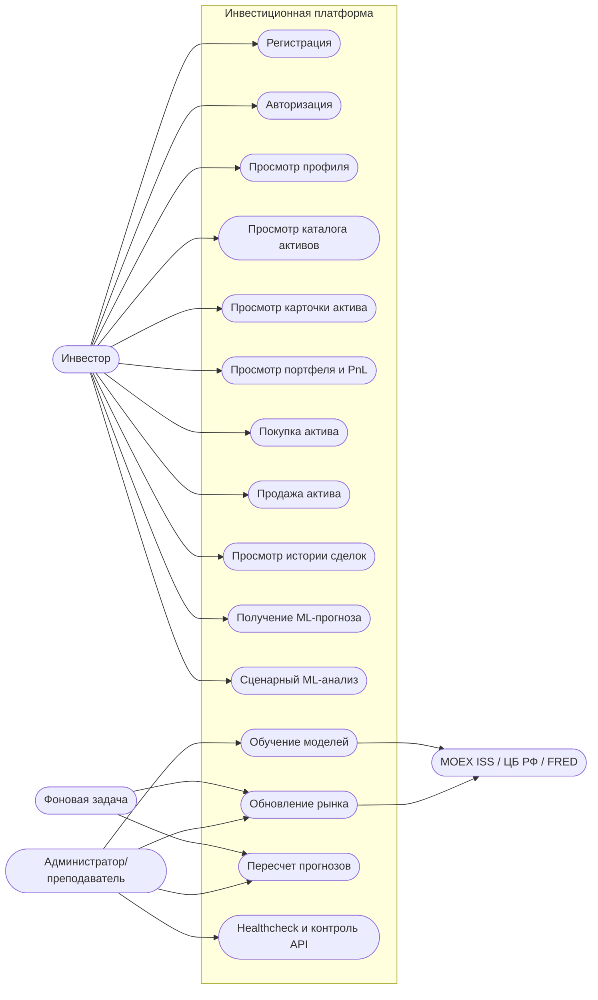
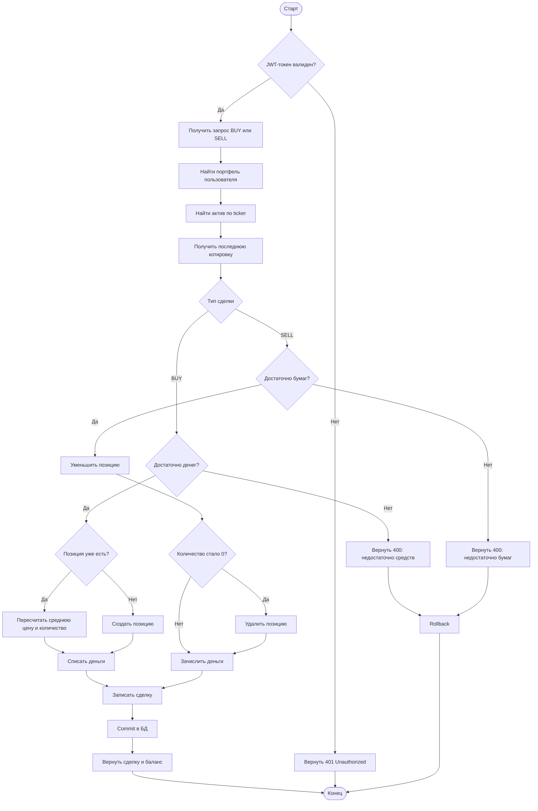
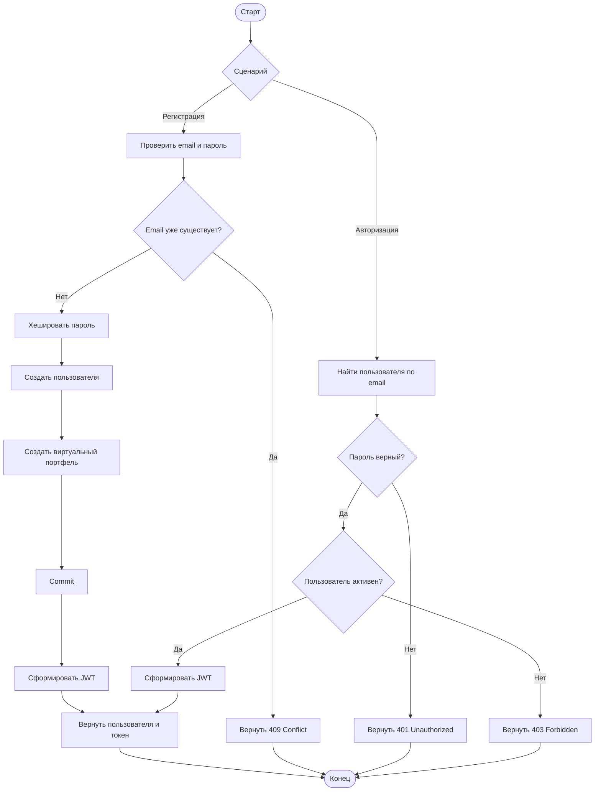
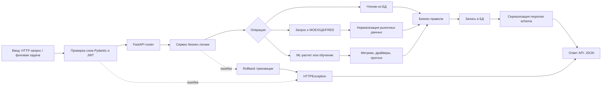
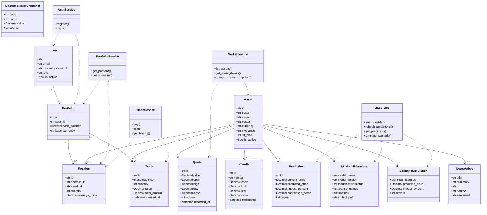
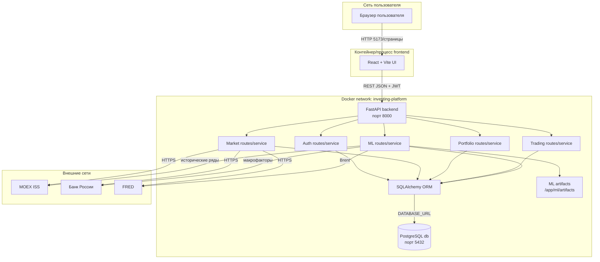

# UML/DB-диаграммы инвестиционной платформы

Файл содержит все диаграммы из раздела проектирования информационной системы: Use Case, две диаграммы активности, процесс обработки данных, диаграмму классов, диаграмму развертывания/компонентов и дополнительную ER-диаграмму БД. Диаграммы описывают текущий репозиторий: `backend` на FastAPI, SQLAlchemy/PostgreSQL, ML-модуль и базовый `frontend` на React/Vite.

Документ нужен не только для формального показа схем, но и для объяснения архитектуры проекта простыми словами. Каждая диаграмма сопровождается расшифровкой: какие элементы на ней показаны, почему они важны, какие файлы репозитория им соответствуют и какой бизнес-сценарий они описывают. Такой формат удобен для защиты проекта: по нему можно быстро объяснить, как пользователь проходит путь от регистрации до покупки актива, как backend обрабатывает запросы, где хранятся данные и как подключается ML-модуль.

## Назначение документа

Документ закрывает раздел проектирования информационной системы. В нем показаны не абстрактные диаграммы, а схемы, привязанные к реальной реализации в репозитории:

- пользовательские сценарии отражают доступные REST endpoint-ы;
- активности повторяют последовательность действий в сервисном слое;
- процесс обработки данных показывает путь запроса от UI/API до БД и ответа;
- диаграмма классов построена вокруг ORM-моделей и сервисов;
- диаграмма развертывания показывает контейнеры, порты, внешние API и внутренние компоненты;
- ER-диаграмма раскрывает структуру базы данных и связи между таблицами.

Главная идея системы: пользователь получает учебный инвестиционный кабинет с виртуальными деньгами, реальными рыночными данными и ML-прогнозами. Он может зарегистрироваться, войти, посмотреть список активов, купить или продать бумаги, увидеть состав портфеля, историю сделок и прогноз по выбранному активу. Backend отвечает за безопасность, бизнес-правила, хранение данных, интеграции с внешними источниками и расчет аналитики.

## Источники для диаграмм

Диаграммы составлены по текущей структуре проекта:

- `backend/app/api/routes/` — REST-маршруты по доменам: авторизация, активы, портфель, торговля, ML и системные операции;
- `backend/app/services/` — бизнес-логика: регистрация, рынок, портфель, сделки и ML;
- `backend/app/db/models.py` — SQLAlchemy ORM-модели, поля таблиц и связи;
- `backend/app/schemas/` — Pydantic-схемы входных и выходных данных;
- `backend/docker-compose.yml` — контейнеры backend и PostgreSQL, порты и переменные окружения;
- `backend/README.md` и файлы `backend/docs/` — описание реализованного функционала и интеграций.

Если в будущем в проект будут добавлены новые экраны frontend, новые endpoint-ы или отдельный контейнер для UI, диаграммы можно расширить без изменения общей логики. Например, можно добавить актера "Гость", отдельный компонент "Frontend container", новые use cases для избранных активов или уведомлений.

## Как читать обозначения

В диаграммах используются стандартные и упрощенные обозначения:

- прямоугольники обозначают действия, компоненты или этапы обработки;
- ромбы обозначают условия и ветвления, например проверку токена или выбор типа сделки;
- цилиндр или круглая база обозначает БД;
- связи `1`, `0..*`, `0..1` на диаграмме классов показывают кратность отношений;
- пунктирные стрелки обычно означают зависимость сервиса от модели, а не прямое владение данными;
- стрелки в activity-диаграммах показывают порядок выполнения действий;
- внешние API выделены отдельно, потому что они находятся вне контура проекта и могут быть недоступны.

Важно: диаграммы не заменяют исходный код, а дают архитектурное представление. Код показывает точную реализацию, а диаграммы объясняют, как части системы связаны между собой на уровне проектирования.

## 2.1 Диаграмма вариантов использования (Use Case)



**Что означает:** диаграмма показывает систему целиком, трех основных актеров и 15 вариантов использования. Она отвечает на вопрос: кто взаимодействует с платформой и какие функции доступны каждому участнику. Такой тип диаграммы нужен на раннем этапе проектирования, потому что он фиксирует границы системы и показывает, какие действия относятся к самой платформе, а какие находятся вне нее.

**Граница системы:** прямоугольная область `Инвестиционная платформа` означает все, что реализуется в проекте: REST API, бизнес-логика, хранение данных, ML-расчеты и системные операции. Внешние источники данных находятся за пределами этой границы. Это важно, потому что MOEX ISS, Банк России и FRED не являются частью приложения, а только предоставляют данные по HTTP.

**Актер "Инвестор":** это основной пользователь системы. В рамках учебной платформы он не совершает реальные биржевые сделки, а работает с виртуальным портфелем. Его сценарии включают регистрацию, вход, просмотр активов, покупку и продажу бумаг, просмотр портфеля, историю сделок и получение ML-прогнозов. По сути, этот актер демонстрирует клиентскую часть продукта и все ключевые бизнес-функции.

**Актер "Администратор/преподаватель":** этот участник отвечает не за обычную торговлю, а за обслуживание системы. Он может проверять состояние backend, запускать обновление рынка, обучение моделей и пересчет прогнозов. В учебном проекте такой актер полезен, потому что преподаватель или разработчик может показать, что система не только отображает данные, но и умеет синхронизировать рынок и поддерживать ML-модуль.

**Актер "Фоновая задача":** отражает автоматические процессы, которые могут выполняться без прямого действия пользователя. Например, обновление котировок и пересчет прогнозов можно запускать по расписанию. Даже если в текущей версии запуск выполняется вручную через системные endpoint-ы, диаграмма показывает проектную возможность автоматизации.

**Внешние API:** `MOEX ISS`, `ЦБ РФ` и `FRED` используются как поставщики рыночной и макроэкономической информации. MOEX дает котировки и исторические свечи по российским активам, Банк России — курс валют и ключевую ставку, FRED — ряд Brent. Эти источники нужны для карточек активов, обновления рынка, обучения моделей и сценарного анализа.

**Связь с endpoint-ами backend:**

| Use case | Пример endpoint-а | Назначение |
| --- | --- | --- |
| Регистрация | `POST /auth/register` | Создает пользователя и виртуальный портфель |
| Авторизация | `POST /auth/login` | Проверяет пароль и возвращает JWT |
| Просмотр профиля | `GET /auth/me` | Возвращает текущего пользователя |
| Просмотр каталога активов | `GET /assets` | Показывает список доступных бумаг |
| Просмотр карточки актива | `GET /assets/{ticker}` | Возвращает актив, котировку, свечи и новости |
| Просмотр портфеля | `GET /portfolio/summary` | Считает баланс, позиции, PnL и аллокацию |
| Покупка актива | `POST /trading/buy` | Создает сделку покупки и обновляет позицию |
| Продажа актива | `POST /trading/sell` | Создает сделку продажи и обновляет баланс |
| История сделок | `GET /trading/history` | Возвращает последние операции пользователя |
| ML-прогноз | `GET /ml/predictions/{ticker}` | Возвращает прогноз цены и драйверы |
| Сценарный анализ | `POST /ml/scenario/{ticker}` | Считает прогноз по пользовательским макрофакторам |
| Healthcheck | `GET /system/health` | Проверяет работоспособность сервиса и БД |

**Почему вариантов использования больше 12:** требование обычно задает минимум 8–12 use cases, но для этого проекта логично показать больше, потому что система включает сразу несколько подсистем: пользовательскую, торговую, рыночную, ML и административную. Избыточность здесь оправдана: она показывает полноту предметной области и помогает на защите объяснить, что платформа не ограничивается одним CRUD.

**Короткий сценарий по диаграмме:** инвестор регистрируется, получает токен, открывает каталог активов, выбирает бумагу, изучает карточку и ML-прогноз, покупает актив, после чего смотрит обновленный портфель и историю сделок. Параллельно администратор или фоновая задача обновляет котировки и пересчитывает прогнозы, чтобы пользователь видел актуальные данные.

## 2.2.1 Диаграмма активности: ключевой бизнес-процесс покупки/продажи актива



**Что означает:** это полный цикл торговой операции из `TradeService`. Диаграмма показывает, как система обрабатывает покупку и продажу актива: от проверки JWT-токена до записи сделки в базу данных. Она нужна для демонстрации ключевого бизнес-процесса проекта, потому что именно операции покупки и продажи превращают обычный каталог активов в инвестиционную платформу.

**Начало процесса:** пользователь отправляет запрос на покупку или продажу через защищенный REST endpoint. Для покупки используется `POST /trading/buy`, для продажи — `POST /trading/sell`. Оба endpoint-а требуют авторизации, поэтому первым логическим шагом является проверка JWT-токена. Если токен отсутствует, истек или некорректен, система не должна выполнять торговую операцию и сразу возвращает ошибку `401 Unauthorized`.

**Получение контекста пользователя:** после успешной авторизации backend определяет текущего пользователя и получает его портфель. В модели данных пользователь связан с одним портфелем, поэтому все сделки выполняются не "сами по себе", а внутри конкретного виртуального брокерского счета. Это важно для корректного расчета баланса, позиций и истории операций.

**Поиск актива и котировки:** система ищет актив по тикеру, который пришел в запросе. Затем берется последняя котировка. Цена сделки в проекте рассчитывается на основе последней известной цены, а не вводится пользователем вручную. Это защищает бизнес-логику от произвольных цен и делает покупку/продажу похожей на рыночную операцию.

**Ветка покупки:** если пользователь покупает актив, система проверяет, достаточно ли виртуальных денег на счете. Сумма сделки рассчитывается как `цена * количество`. Если средств недостаточно, операция отклоняется с ошибкой `400`. Если денег хватает, система либо создает новую позицию, либо обновляет уже существующую. При повторной покупке той же бумаги пересчитывается средняя цена владения, потому что пользователь мог покупать актив по разным ценам.

**Ветка продажи:** если пользователь продает актив, система проверяет, есть ли у него позиция и достаточно ли бумаг для продажи. Нельзя продать больше, чем есть в портфеле. Если количество после продажи становится равным нулю, позиция удаляется, чтобы в портфеле не хранились пустые строки. Если часть бумаг остается, система просто уменьшает количество.

**Запись сделки:** после изменения баланса и позиции создается запись в таблице `trades`. Эта запись нужна для истории операций и аудита действий пользователя. Даже если позиция изменилась, сама сделка остается отдельным фактом: что купили или продали, сколько, по какой цене, на какую сумму и когда.

**Транзакционность:** изменения баланса, позиции и сделки должны быть согласованы. Поэтому процесс завершается `commit` в БД. Если возникает ошибка, выполняется `rollback`, чтобы не получилось ситуации, когда деньги списались, а сделка не сохранилась, или наоборот. Это особенно важно для финансовых систем, даже если деньги в проекте виртуальные.

**Основные бизнес-правила процесса:**

- пользователь должен быть авторизован;
- актив должен существовать в справочнике;
- сделка выполняется по последней известной котировке;
- при покупке баланс не может уйти в минус;
- при продаже нельзя продать больше активов, чем есть в позиции;
- каждая успешная операция записывается в историю сделок;
- при любой ошибке изменения в БД откатываются.

**Связь с кодом:** процесс соответствует сервису `backend/app/services/trade_service.py`. Получение портфеля выполняется через `PortfolioService`, получение актива и котировки — через `MarketService`, а запись результата идет в ORM-модели `Position`, `Trade` и `Portfolio`. Такая структура отделяет HTTP-слой от бизнес-логики: route принимает запрос, а сервис выполняет правила.

## 2.2.2 Диаграмма активности: регистрация и авторизация пользователя



**Что означает:** диаграмма разделяет два связанных сценария: регистрацию и авторизацию. Оба сценария относятся к подсистеме безопасности, но решают разные задачи. Регистрация создает нового пользователя и стартовый портфель, а авторизация проверяет учетные данные уже существующего пользователя и выдает токен для доступа к закрытым функциям.

**Регистрация:** пользователь передает email и пароль. Система сначала проверяет входные данные через Pydantic-схему, затем смотрит, существует ли пользователь с таким email. Если email уже занят, регистрация останавливается, потому что поле `email` является уникальным идентификатором пользователя. Если email свободен, пароль не сохраняется в открытом виде: он хешируется, после чего в БД создается запись пользователя.

**Создание портфеля при регистрации:** важная особенность проекта — портфель создается автоматически сразу после создания пользователя. Это избавляет систему от неопределенного состояния, когда пользователь есть, но инвестировать он не может. После регистрации у него уже есть виртуальный счет с базовой валютой и начальным балансом, поэтому он может сразу открыть портфель или выполнить покупку.

**Авторизация:** пользователь передает email и пароль. Backend ищет пользователя по email и проверяет пароль с учетом сохраненного хеша. Если пароль неправильный, возвращается ошибка авторизации. Если пользователь найден и пароль верный, дополнительно проверяется статус активности. Это позволяет в будущем блокировать учетные записи, не удаляя их из базы данных.

**JWT-токен:** после успешной регистрации или входа система формирует JWT. Токен нужен, чтобы последующие запросы к защищенным endpoint-ам не требовали повторной передачи пароля. Клиент отправляет токен в заголовке `Authorization: Bearer ...`, а backend извлекает текущего пользователя через dependency `get_current_user`.

**Почему регистрация и вход на одной диаграмме:** эти сценарии объединены, потому что оба заканчиваются одинаковым результатом: пользователь получает объект профиля и токен доступа. Разница только в начальных шагах. Регистрация создает новые записи в БД, а авторизация использует уже существующие.

**Защищаемые операции после входа:**

- просмотр текущего профиля;
- получение портфеля и позиций;
- покупка и продажа активов;
- просмотр истории сделок;
- запуск пользовательских ML-сценариев, если endpoint требует пользователя;
- любые будущие операции, связанные с личными данными.

**Связь с кодом:** логика находится в `backend/app/services/auth_service.py`, а маршруты — в `backend/app/api/routes/auth.py`. Сервис использует функции безопасности из `backend/app/core/security.py`, ORM-модель `User` и модель `Portfolio`. Такой подход делает авторизацию отдельным модулем, который можно развивать независимо от торговой логики.

**Результат процесса:** после регистрации пользователь получает не просто учетную запись, а готовую рабочую среду: профиль, портфель, баланс и JWT-токен. После авторизации он получает доступ к той же среде без повторного создания данных.

## 2.3 Диаграмма процесса обработки данных



**Что означает:** схема показывает общий конвейер обработки данных в системе: `ввод → проверки → маршрутизация → бизнес-логика → чтение/расчет/интеграции → запись в БД → JSON-ответ`. В отличие от activity-диаграмм, которые описывают конкретные сценарии, эта схема показывает универсальный жизненный цикл почти любого запроса или фоновой операции в backend.

**Ввод данных:** источником может быть HTTP-запрос от клиента, запрос из Swagger UI, ручной системный вызов или фоновая задача. Например, пользователь может отправить запрос на покупку актива, а администратор — запрос на обновление рыночных данных. Несмотря на разные сценарии, начальный путь одинаковый: данные попадают в FastAPI-приложение.

**Проверка данных:** FastAPI и Pydantic проверяют структуру входных данных. Если поле отсутствует, имеет неправильный тип или не проходит ограничение, запрос не доходит до бизнес-логики. Для защищенных операций дополнительно проверяется JWT-токен. Это снижает количество ошибок в сервисном слое, потому что туда попадают уже валидированные данные.

**Маршрутизация:** после базовой проверки запрос попадает в нужный router. В проекте маршруты разделены по доменам: `auth`, `assets`, `portfolio`, `trading`, `ml`, `system`. Такое разделение упрощает поддержку: разработчик быстро понимает, где искать endpoint по конкретной функции.

**Сервис бизнес-логики:** route не должен содержать сложные правила. Он вызывает сервис, а сервис уже решает, что именно нужно сделать. Например, торговый endpoint вызывает `TradeService`, endpoint портфеля — `PortfolioService`, endpoint прогнозов — `MLService`. Это соответствует паттерну service layer и делает код более тестируемым.

**Чтение из БД:** многие операции начинаются с получения текущего состояния: пользователя, портфеля, актива, последней котировки, позиций или сохраненных прогнозов. Для этого используется SQLAlchemy Session. ORM-модели позволяют работать с таблицами как с Python-объектами, но при этом сохранять связи и ограничения базы данных.

**Запрос к внешним источникам:** некоторые операции требуют данных, которых еще нет в локальной БД или которые нужно обновить. Тогда сервис обращается к MOEX ISS, Банку России или FRED. Эти данные затем нормализуются: приводятся к внутренним названиям полей, типам и форматам, удобным для записи в БД и дальнейших расчетов.

**ML-ветка:** для прогнозов и сценарного анализа используются исторические рыночные данные, макрофакторы, сохраненные артефакты моделей и метрики. Результатом ML-ветки становится прогноз цены, процент влияния, confidence score и список драйверов. Эти данные показывают не только число, но и объяснение результата.

**Применение бизнес-правил:** после чтения данных и расчетов сервис выполняет правила предметной области. Например, проверяет баланс перед покупкой, количество бумаг перед продажей, наличие актива, корректность тикера, доступность модели или необходимость fallback-режима. Именно здесь технический запрос превращается в осмысленную операцию системы.

**Запись в БД:** если операция изменяет состояние, результат сохраняется. Это может быть новая сделка, обновленная позиция, новая котировка, свеча, ML-прогноз, сценарный расчет или метаданные модели. Сохранение позволяет повторно использовать данные без постоянного обращения к внешним API.

**Формирование ответа:** после успешной операции данные преобразуются в response schema. Это нужно, чтобы API возвращал клиенту стабильный и понятный JSON, а не внутренние ORM-объекты. Например, портфель возвращается не как набор таблиц, а как удобная сводка: баланс, стоимость позиций, PnL, количество позиций и распределение активов.

**Обработка ошибок:** если ошибка возникает на этапе валидации, пользователь получает структурированный ответ FastAPI. Если ошибка появляется внутри сервиса, она преобразуется в `HTTPException`, а изменения в БД откатываются. Такой подход делает поведение API предсказуемым и предотвращает частично сохраненные операции.

**Пример полного прохода:** при покупке актива клиент отправляет JSON с тикером и количеством. FastAPI проверяет схему и JWT, router вызывает `TradeService`, сервис читает портфель и котировку, проверяет баланс, обновляет позицию, записывает сделку, делает `commit` и возвращает JSON с данными сделки и новым балансом.

**Пример системного прохода:** при обновлении рынка endpoint `/system/market/refresh` вызывает сервис рынка. Сервис получает данные из внешних API, нормализует котировки и свечи, сохраняет их в БД и возвращает количество обновленных записей. Пользовательские данные при этом не меняются, но карточки активов и прогнозы становятся актуальнее.

## 2.4 Диаграмма классов



**Что означает:** диаграмма объединяет доменные ORM-классы и сервисный слой. Она показывает, какие основные сущности есть в предметной области, какими полями они обладают и как связаны между собой. Дополнительно показаны сервисы, потому что именно они управляют жизненным циклом этих сущностей в коде.

**Пользователь и портфель:** класс `User` хранит учетные данные, роль и статус активности. Один пользователь связан с одним `Portfolio`. Такое отношение `1 → 1` выбрано потому, что в учебной платформе у пользователя один виртуальный инвестиционный счет. Портфель хранит свободный денежный баланс и базовую валюту, а его детальное состояние раскрывается через позиции и сделки.

**Актив как центральная рыночная сущность:** `Asset` описывает бумагу или инструмент, доступный на платформе. У него есть тикер, название, сектор, валюта, биржа, режим торгов и размер лота. От актива расходится много связей: котировки, свечи, позиции, сделки, прогнозы, новости, ML-метаданные и сценарные расчеты. Поэтому `Asset` является центральной сущностью рыночной части системы.

**Позиция:** `Position` показывает, сколько конкретного актива находится в портфеле пользователя и по какой средней цене он был куплен. Связь позиции одновременно идет к портфелю и активу. Ограничение уникальности `portfolio_id + asset_id` означает, что в одном портфеле не должно быть двух отдельных строк по одному и тому же активу. Если пользователь докупает бумагу, обновляется существующая позиция.

**Сделка:** `Trade` хранит исторический факт покупки или продажи. В отличие от позиции, сделка не перезаписывается при новых операциях. Даже если пользователь полностью продал актив, история сделок остается. Это нужно для журнала операций, анализа действий пользователя и восстановления истории изменения портфеля.

**Котировки и свечи:** `Quote` хранит снимок текущего рыночного состояния, а `Candle` — историческую OHLCV-свечу за интервал. Котировки нужны для карточки актива и расчета цены сделки. Свечи нужны для графиков, обучения моделей и анализа динамики. Разделение котировок и свечей делает модель данных более понятной: текущие данные и исторические ряды не смешиваются.

**ML-сущности:** `Prediction` хранит готовый прогноз по активу, `MLModelMetadata` — информацию о модели, ее статусе, признаках, метриках и пути к артефакту, а `ScenarioSimulation` — результат пользовательского сценарного расчета. Такое разделение полезно, потому что прогноз, модель и сценарий имеют разный жизненный цикл. Модель обучается периодически, прогноз может пересчитываться регулярно, а сценарии создаются по запросу пользователя.

**Новости и макрофакторы:** `NewsArticle` привязан к активу и может использоваться для отображения информационного фона. `MacroIndicatorSnapshot` хранит макроэкономические показатели независимо от конкретного актива. Макрофакторы нужны для ML-модуля и сценарного анализа, поэтому они выделены отдельно, а не встроены в таблицу активов.

**Сервисы:** `AuthService`, `MarketService`, `PortfolioService`, `TradeService` и `MLService` являются слоем бизнес-логики. Они не являются таблицами БД, но показаны на диаграмме, чтобы было видно, какие классы к каким данным обращаются. Например, `TradeService` зависит от `Trade` и `Position`, потому что он создает сделки и обновляет позиции. `MLService` зависит от прогнозов, метаданных моделей и сценарных симуляций.

**Использованные архитектурные паттерны:**

- `REST API` — клиент взаимодействует с системой через HTTP endpoint-ы;
- `Service Layer` — бизнес-правила вынесены в сервисы, а не хранятся внутри route-функций;
- `Repository-подход через ORM Session` — доступ к данным идет через SQLAlchemy Session и ORM-модели;
- `DTO/Schema` — входные и выходные структуры описаны Pydantic-схемами;
- `MVC-подобное разделение` — route выполняет роль controller, сервисы — model/business layer, frontend — view layer;
- `Integration Adapter` — внешний рынок инкапсулирован в клиенте рыночных данных.

**Почему диаграмма не показывает все поля:** для читаемости на схеме показаны только ключевые атрибуты. В коде моделей есть дополнительные технические поля, например `created_at`, `updated_at`, `source`, `description`, `notes`. На диаграмме они частично опущены, потому что главная цель — показать структуру предметной области, а не полностью продублировать файл `models.py`.

**Практическая польза диаграммы:** по ней можно быстро объяснить, как данные связаны между собой. Например, чтобы посчитать портфель, нужно взять `Portfolio`, его `Position`, связанные `Asset` и последние `Quote`. Чтобы показать ML-прогноз, нужно взять `Asset`, связанную `Prediction`, а при необходимости — `MLModelMetadata`. Чтобы показать историю сделок, нужны `Trade`, `Asset` и `Portfolio`.

## 2.5 Диаграмма развертывания и компонентов



**Что означает:** диаграмма показывает развертывание системы и ее основные компоненты. Она отвечает на вопрос: где физически или логически находится каждая часть приложения, по каким портам идет взаимодействие и какие внешние системы подключаются к backend.

**Клиентская зона:** пользователь работает через браузер. В браузере открывается frontend-приложение на React/Vite. Frontend отвечает за отображение экранов, форм, таблиц, карточек, графиков и сообщений. Он не должен напрямую обращаться к БД или внешним финансовым API. Все такие операции проходят через backend, чтобы сохранить безопасность и единые бизнес-правила.

**Frontend:** в текущем репозитории frontend находится в папке `frontend` и построен на Vite. Обычно Vite dev server использует порт `5173`. В production-сценарии frontend может быть собран в статические файлы и раздаваться отдельным web-сервером, но на диаграмме показан учебный вариант запуска как отдельного процесса. Frontend отправляет REST-запросы к backend и передает JWT-токен для защищенных операций.

**Backend:** FastAPI-приложение слушает порт `8000`. Это основной сервер системы. Внутри него выделены компоненты по доменам: авторизация, рынок, портфель, торговля и ML. Такое деление соответствует структуре папок `routes` и `services`. Backend принимает запросы, валидирует данные, применяет бизнес-логику, обращается к БД и внешним API, а затем возвращает JSON-ответы.

**База данных:** PostgreSQL слушает порт `5432` внутри docker-compose. БД хранит пользователей, портфели, активы, котировки, свечи, сделки, позиции, прогнозы, новости и метаданные моделей. Backend подключается к БД через `DATABASE_URL`, а работа с таблицами выполняется через SQLAlchemy ORM. В `docker-compose.yml` для базы используется volume, чтобы данные не исчезали после перезапуска контейнера.

**Docker network:** backend и БД находятся в общей docker-сети. Это означает, что backend может обращаться к базе по имени сервиса `db`, а не по внешнему адресу. Такой подход упрощает деплой и уменьшает зависимость от локальных настроек компьютера разработчика. Порт `5432` может быть проброшен наружу для отладки, но основное взаимодействие внутри compose идет по внутренней сети.

**ML artifacts:** ML-модуль не только считает прогнозы, но и сохраняет артефакты моделей на диск. На диаграмме они выделены отдельным хранилищем `/app/ml/artifacts`. Это не таблица БД, а файловое хранилище обученных моделей, например `joblib`-файлов. В БД при этом хранится путь к артефакту, метрики и статус модели.

**Внешние API:** backend обращается к MOEX ISS, Банку России и FRED по HTTPS. Эти источники находятся вне docker-сети и могут быть временно недоступны. Поэтому при проектировании важно учитывать fallback-режимы, обработку ошибок и кэширование в БД. Локальная база позволяет платформе продолжать показывать ранее загруженные данные, даже если внешний сервис не ответил.

**Порты и взаимодействия:**

| Компонент | Порт/канал | Назначение |
| --- | --- | --- |
| Browser → Frontend | `5173` | Открытие UI при локальной разработке |
| Frontend → Backend | `8000` | REST JSON-запросы и JWT |
| Backend → PostgreSQL | `5432` | Чтение и запись данных |
| Backend → MOEX/ЦБ/FRED | `HTTPS` | Получение рыночных и макроданных |
| Backend → ML artifacts | файловая система | Загрузка и сохранение обученных моделей |

**Почему компоненты разделены:** разделение UI, backend и DB упрощает поддержку и масштабирование. Frontend можно менять без изменения БД, backend можно тестировать через Swagger без готового UI, а БД можно заменить или перенести в managed-сервис при сохранении ORM-слоя. Такая архитектура ближе к реальным web-приложениям, чем монолитный скрипт.

**Возможное развитие диаграммы:** если проект расширять, на схему можно добавить отдельный контейнер frontend, reverse proxy `Nginx`, очередь задач для фоновых обновлений, Redis-кэш, отдельный worker для ML-обучения и monitoring. Но для текущего репозитория достаточно показать три главных слоя: клиент, backend и БД, плюс внешние поставщики данных.

## Дополнительно: DB/ER-диаграмма базы данных

```mermaid
erDiagram
    USERS ||--|| PORTFOLIOS : owns
    PORTFOLIOS ||--o{ POSITIONS : contains
    PORTFOLIOS ||--o{ TRADES : records
    ASSETS ||--o{ POSITIONS : held_as
    ASSETS ||--o{ TRADES : traded_as
    ASSETS ||--o{ QUOTES : has
    ASSETS ||--o{ CANDLES : has
    ASSETS ||--o{ PREDICTIONS : has
    ASSETS ||--o| ML_MODEL_METADATA : trains
    ASSETS ||--o{ SCENARIO_SIMULATIONS : simulates
    ASSETS ||--o{ NEWS_ARTICLES : mentions

    USERS {
        string id PK
        string email UK
        string hashed_password
        string role
        boolean is_active
        datetime created_at
        datetime updated_at
    }
    PORTFOLIOS {
        string id PK
        string user_id FK_UK
        numeric cash_balance
        string base_currency
        datetime created_at
        datetime updated_at
    }
    ASSETS {
        string id PK
        string ticker UK
        string name
        string sector
        string currency
        string exchange
        integer lot_size
        boolean is_active
    }
    POSITIONS {
        string id PK
        string portfolio_id FK
        string asset_id FK
        integer quantity
        numeric average_price
    }
    TRADES {
        string id PK
        string portfolio_id FK
        string asset_id FK
        enum side
        integer quantity
        numeric price
        numeric total_amount
        datetime created_at
    }
    QUOTES {
        string id PK
        string asset_id FK
        numeric price
        numeric open
        numeric high
        numeric low
        numeric close
        integer volume
        datetime recorded_at
    }
    CANDLES {
        string id PK
        string asset_id FK
        string interval
        numeric open
        numeric high
        numeric low
        numeric close
        integer volume
        datetime timestamp
    }
    PREDICTIONS {
        string id PK
        string asset_id FK
        numeric current_price
        numeric predicted_price
        numeric impact_percent
        numeric confidence_score
        json drivers
        datetime generated_at
    }
    ML_MODEL_METADATA {
        string id PK
        string asset_id FK_UK
        string model_name
        string model_version
        enum status
        json feature_names
        json metrics
        string artifact_path
    }
    SCENARIO_SIMULATIONS {
        string id PK
        string asset_id FK
        json input_features
        numeric predicted_price
        numeric impact_percent
        json drivers
        datetime created_at
    }
    NEWS_ARTICLES {
        string id PK
        string asset_id FK
        string title
        string url
        string source
        string sentiment
        datetime published_at
    }
    MACRO_INDICATOR_SNAPSHOTS {
        string id PK
        string code
        string name
        numeric value
        string source
        datetime recorded_at
    }
```

**Что означает:** ER-диаграмма фиксирует структуру базы данных. Она показывает таблицы, ключевые поля и связи между сущностями. Если диаграмма классов объясняет объектную модель приложения, то ER-диаграмма делает акцент именно на хранении данных: первичных ключах, внешних ключах, уникальности и кратности связей.

**USERS:** таблица пользователей хранит учетные записи. Поле `email` уникально, потому что используется для входа и не должно повторяться. Пароль хранится как `hashed_password`, а не в открытом виде. Поля `role` и `is_active` позволяют различать роли и отключать пользователя без удаления его данных.

**PORTFOLIOS:** таблица портфелей связана с пользователем отношением `1 к 1`. Внешний ключ `user_id` одновременно уникален, поэтому один пользователь не может иметь несколько портфелей в текущей модели. Портфель хранит свободные деньги (`cash_balance`) и базовую валюту. Все позиции и сделки привязаны именно к портфелю.

**ASSETS:** таблица активов является справочником инструментов. У каждого актива есть уникальный тикер, название, сектор, валюта, биржа и размер лота. Через `ASSETS` связываются рыночные данные, пользовательские позиции, сделки и ML-результаты. Это позволяет не дублировать информацию об активе в каждой сделке или котировке.

**POSITIONS:** таблица позиций показывает текущее состояние портфеля. Она связывает портфель и актив. Уникальность пары `portfolio_id + asset_id` нужна, чтобы по одному активу в одном портфеле была только одна текущая позиция. Если пользователь докупает актив, обновляется количество и средняя цена, а не создается новая позиция.

**TRADES:** таблица сделок хранит журнал операций. В ней фиксируется сторона сделки (`BUY` или `SELL`), количество, цена, сумма и дата. Сделки не заменяют позиции: позиция показывает текущее состояние, а сделка — историческое событие. Благодаря этому можно одновременно быстро показать текущий портфель и восстановить историю действий.

**QUOTES:** таблица котировок хранит рыночные снимки. Она привязана к активу и содержит цену, open/high/low/close, предыдущую цену закрытия, процент изменения, объем, источник и время записи. Эти данные используются для карточки актива, цены сделки и обновления рыночного состояния.

**CANDLES:** таблица свечей хранит исторические OHLCV-данные. Уникальное ограничение `asset_id + interval + timestamp` предотвращает дублирование свечей за один и тот же период. Исторические свечи важны для графиков, расчетов доходности и обучения ML-моделей.

**PREDICTIONS:** таблица прогнозов хранит результат ML-расчета по активу. Помимо текущей и прогнозной цены, она содержит процент влияния, confidence score, горизонт прогноза, текстовое объяснение и список драйверов. Наличие поля `is_placeholder` позволяет отличать настоящие прогнозы от временных или fallback-значений.

**ML_MODEL_METADATA:** таблица метаданных модели связана с активом отношением `1 к 0..1`. Для одного актива может быть одна актуальная запись о модели. Здесь хранится название модели, версия, статус, список признаков, метрики, параметры и путь к файловому артефакту. Это позволяет показывать качество модели и понимать, обучена ли она.

**SCENARIO_SIMULATIONS:** таблица сценарных расчетов хранит результаты пользовательского анализа. Пользователь задает макрофакторы, система считает прогноз и сохраняет входные параметры вместе с результатом. Это полезно для повторного просмотра сценариев и демонстрации того, какие факторы повлияли на прогноз.

**NEWS_ARTICLES:** таблица новостей связана с активом опционально. Новость может относиться к конкретной бумаге, но в будущем можно хранить и общерыночные новости без жесткой привязки. Поля `sentiment` и `source` позволяют показывать тональность и источник информации.

**MACRO_INDICATOR_SNAPSHOTS:** таблица макроиндикаторов не связана внешним ключом с активами, потому что макрофакторы являются общерыночными. Например, курс USD/RUB, ключевая ставка или Brent могут влиять сразу на множество активов. Поэтому они хранятся отдельно и используются ML-модулем при подготовке признаков.

**Ключевые связи БД:**

- `USERS → PORTFOLIOS`: один пользователь владеет одним портфелем;
- `PORTFOLIOS → POSITIONS`: один портфель содержит много текущих позиций;
- `PORTFOLIOS → TRADES`: один портфель имеет много исторических сделок;
- `ASSETS → QUOTES`: один актив имеет много котировок;
- `ASSETS → CANDLES`: один актив имеет много исторических свечей;
- `ASSETS → PREDICTIONS`: один актив может иметь много сохраненных прогнозов;
- `ASSETS → ML_MODEL_METADATA`: один актив имеет не более одной актуальной записи о модели;
- `ASSETS → SCENARIO_SIMULATIONS`: один актив может участвовать во многих сценарных расчетах;
- `ASSETS → NEWS_ARTICLES`: один актив может иметь много связанных новостей.

**Почему БД нормализована:** активы, пользователи, портфели, позиции и сделки вынесены в отдельные таблицы, чтобы не дублировать данные. Например, название и сектор актива не хранятся в каждой сделке. Вместо этого сделка ссылается на `asset_id`, а подробности подтягиваются через связь. Это уменьшает вероятность ошибок и облегчает обновление справочников.

**Что можно добавить в будущем:** если развивать проект, можно добавить таблицы для заявок, избранных активов, уведомлений, ролей и прав, audit log, пользовательских настроек, refresh-токенов и результатов backtesting. Текущая модель уже содержит базовые сущности, необходимые для учебной инвестиционной платформы с ML.

## Краткое соответствие требованиям

| Требование | Где выполнено |
| --- | --- |
| Минимум 2 актера и 8–12+ use cases | Раздел 2.1: 3 актера и 15 use cases |
| Минимум 2 диаграммы активности | Разделы 2.2.1 и 2.2.2 |
| Полный цикл обработки данных | Раздел 2.3 |
| REST API, MVC/service layer и дополнительные паттерны | Раздел 2.4 |
| Порты, контейнеры и сети | Раздел 2.5 |
| DB-диаграмма | Дополнительная ER-диаграмма |

## Как использовать эти диаграммы при защите

Начинать объяснение удобно с Use Case-диаграммы. Она показывает, для кого создана система и какие задачи она решает. Сначала можно сказать, что основным пользователем является инвестор, который работает с виртуальным портфелем, а администратор или преподаватель управляет системными функциями: обновлением рынка, обучением моделей и проверкой работоспособности. После этого логично перейти к диаграммам активности и показать, как конкретные пользовательские сценарии выполняются внутри backend.

Для демонстрации бизнес-логики лучше всего подходит диаграмма покупки/продажи. Она показывает, что система не просто сохраняет форму в БД, а выполняет проверки: авторизация, существование актива, наличие котировки, достаточность денег или бумаг, обновление позиции, запись сделки и транзакционное сохранение. Это важный аргумент в пользу того, что в проекте есть полноценная серверная логика.

Диаграмма регистрации и авторизации нужна для объяснения безопасности. На ней видно, что пароль не хранится как обычный текст, пользователь получает JWT, а защищенные операции требуют токен. Также можно подчеркнуть автоматическое создание портфеля при регистрации: это связывает модуль авторизации с доменной логикой инвестиционной платформы.

Диаграмма процесса обработки данных помогает объяснить общий backend-пайплайн. Ее удобно использовать, когда нужно ответить на вопрос "что происходит после нажатия кнопки в интерфейсе". Запрос проходит проверку, попадает в router, затем в сервис, сервис читает или записывает БД, при необходимости обращается к внешним API или ML-модулю, после чего возвращает структурированный JSON.

Диаграмма классов нужна для технического объяснения. По ней можно показать, какие сущности являются главными: пользователь, портфель, актив, позиция, сделка, котировка, свеча, прогноз и модель. Отдельно стоит подчеркнуть сервисы: они отделяют бизнес-логику от HTTP-маршрутов и делают архитектуру более аккуратной.

Диаграмма развертывания нужна, чтобы показать, что проект можно запускать как систему из нескольких компонентов. Backend работает на порту `8000`, PostgreSQL — на `5432`, frontend в dev-режиме — на `5173`, а внешние API подключаются по HTTPS. Эта диаграмма особенно полезна, если спрашивают про Docker, контейнеры, порты и сетевое взаимодействие.

ER-диаграмма нужна для объяснения базы данных. На ней видно, что данные не хранятся в одной общей таблице, а разделены по смыслу: пользователи, портфели, активы, позиции, сделки, рыночные данные и ML-результаты. Это показывает нормализацию БД и готовность системы к расширению.

## Краткое итоговое описание архитектуры

Инвестиционная платформа построена как web-система с разделением на клиентскую часть, backend и базу данных. Пользователь работает через интерфейс или Swagger UI, отправляя REST-запросы. Backend на FastAPI принимает запросы, проверяет входные данные, авторизацию и права доступа, после чего передает управление сервисам. Сервисы реализуют бизнес-логику: регистрацию, создание портфеля, получение активов, покупку и продажу, расчет PnL, обновление рынка, обучение моделей и формирование прогнозов.

Данные хранятся в PostgreSQL через SQLAlchemy ORM. Пользователь связан с портфелем, портфель — с позициями и сделками, актив — с котировками, свечами, прогнозами, новостями и ML-метаданными. Такая структура позволяет отдельно хранить текущее состояние портфеля, историю операций и рыночную аналитику. Для внешних данных используются MOEX ISS, Банк России и FRED. Для ML используются исторические ряды, макрофакторы, сохраненные артефакты моделей и таблицы прогнозов.

Система спроектирована так, чтобы каждый модуль отвечал за свою часть. API-слой отвечает за маршруты, schema-слой — за формат данных, service-слой — за бизнес-правила, ORM-модели — за структуру БД, integration-слой — за внешние источники, а ML-модуль — за обучение и прогнозирование. Благодаря этому проект можно развивать по частям: добавлять новые активы, новые экраны, дополнительные роли, улучшенные модели, отдельные фоновые worker-ы или новые источники данных.
