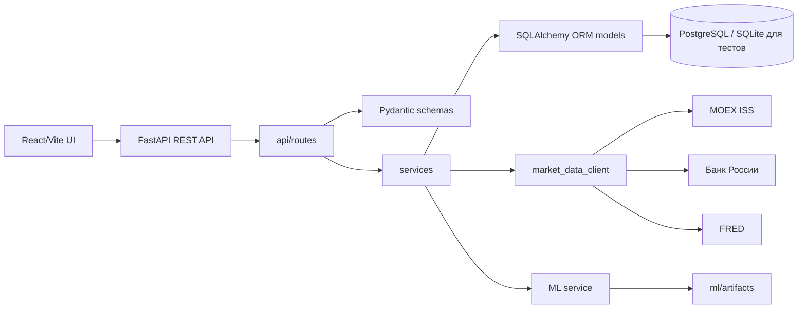
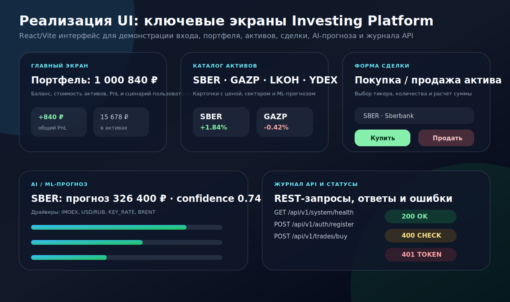
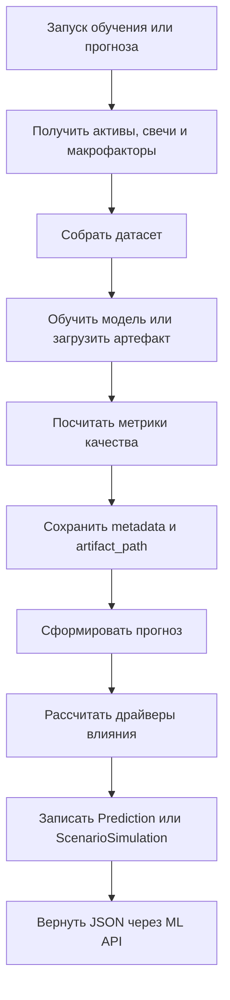

# 3. Реализация информационной системы

Этот документ описывает, что реально реализовано в репозитории инвестиционной платформы: структуру проекта, стек технологий, серверную часть, пользовательский интерфейс, ML-модуль и контейнеризацию. Раздел соответствует пункту 3 из требований: показать UI, Server, DB, AI и Docker, привести примеры API, фрагменты кода, сценарии пользователя и объяснить, как проект собрать и запустить.

## 3.1 Структура проекта и стек

Проект разделен на две основные части: `backend` и `frontend`. Backend отвечает за REST API, бизнес-логику, работу с БД, интеграции с внешними источниками и ML-модуль. Frontend отвечает за пользовательский интерфейс: демонстрационный инвестиционный кабинет, список активов, форму сделки, ML-прогноз и журнал API-операций
```text
Investing-platform/
  backend/
    app/
      api/
        dependencies.py
        router.py
        routes/
          auth.py
          assets.py
          portfolio.py
          trading.py
          ml.py
          system.py
      core/
        config.py
        security.py
      db/
        database.py
        models.py
        seed.py
      integrations/
        market_data_client.py
      schemas/
        auth.py
        asset.py
        portfolio.py
        trade.py
        ml.py
        system.py
      services/
        auth_service.py
        market_service.py
        portfolio_service.py
        trade_service.py
        ml_service.py
        bootstrap_service.py
      main.py
    docs/
      API_RU.md
      BACKEND_RU.md
      DIAGRAMS_RU.md
      IMPLEMENTATION_RU.md
      MARKET_DATA_RU.md
      ML_RU.md
    tests/
      test_api_smoke.py
    Dockerfile
    docker-compose.yml
    requirements.txt
  frontend/
    src/
      App.jsx
      App.css
      index.css
      main.jsx
    package.json
    vite.config.js
```

### Схема модулей



### Используемый стек

| Слой | Технологии | Назначение |
| --- | --- | --- |
| UI | React 19, Vite, CSS | Пользовательские экраны, карточки, формы, статусы |
| API | FastAPI, Uvicorn | REST endpoint-ы, Swagger UI, ReDoc |
| Валидация | Pydantic | Схемы запросов и ответов |
| БД | PostgreSQL, SQLite для тестов | Основное хранение данных и тестовая БД |
| ORM | SQLAlchemy | Модели, связи, запросы, транзакции |
| Безопасность | JWT, OAuth2PasswordBearer, password hashing | Авторизация и защита пользовательских операций |
| ML | scikit-learn/joblib-подход, макрофакторы | Обучение моделей, прогнозы, сценарный анализ |
| Интеграции | MOEX ISS, ЦБ РФ, FRED | Реальные рыночные и макроэкономические данные |
| Контейнеризация | Docker, docker compose | Запуск backend и БД в контейнерах |
| Тесты | pytest, FastAPI TestClient | Smoke-проверка API, healthcheck и auth flow |

### Как собрать и запустить

Локальный запуск backend:

```powershell
cd backend
python -m venv .venv
.venv\Scripts\activate
pip install -r requirements.txt
copy .env.example .env
uvicorn app.main:app --reload
```

Локальный запуск frontend:

```powershell
cd frontend
npm install
npm run dev
```

Запуск backend и PostgreSQL через Docker:

```powershell
cd backend
copy .env.example .env
docker compose up --build
```

После запуска backend документация API доступна по адресам:

- `http://localhost:8000/docs` — Swagger UI;
- `http://localhost:8000/redoc` — ReDoc;
- `http://localhost:8000/api/v1/system/health` — healthcheck.

## 3.2 Реализация серверной части

Серверная часть реализована на FastAPI. Она содержит маршруты API, сервисы бизнес-логики, ORM-модели, схемы данных, интеграции с внешним рынком и ML-функции. Основной вход в приложение находится в `backend/app/main.py`, а общий API-роутер собирается в `backend/app/api/router.py`.

### Основные домены API

| Домен | Файл | Что реализовано |
| --- | --- | --- |
| Authentication | `backend/app/api/routes/auth.py` | Регистрация, вход, Swagger token, текущий пользователь |
| Assets | `backend/app/api/routes/assets.py` | Список активов, карточка актива, свечи, новости |
| Portfolio | `backend/app/api/routes/portfolio.py` | Сводка портфеля, позиции пользователя |
| Trading | `backend/app/api/routes/trading.py` | Покупка, продажа, история сделок |
| ML Sandbox | `backend/app/api/routes/ml.py` | Прогноз, метаданные модели, сценарный анализ |
| System | `backend/app/api/routes/system.py` | Healthcheck, обновление рынка, обучение и refresh ML |

### Примеры API запрос/ответ

#### Регистрация пользователя

```http
POST /api/v1/auth/register
Content-Type: application/json

{
  "email": "investor@example.com",
  "password": "securepass123"
}
```

Пример ответа:

```json
{
  "user": {
    "id": "b5c0c1d1-1b2a-4d89-92b2-3d6e9b20f612",
    "email": "investor@example.com",
    "role": "investor",
    "is_active": true,
    "created_at": "2026-04-27T10:00:00"
  },
  "token": {
    "access_token": "eyJhbGciOiJIUzI1NiIsInR5cCI6IkpXVCJ9...",
    "token_type": "bearer",
    "expires_in_minutes": 1440
  }
}
```

#### Получение портфеля

```http
GET /api/v1/portfolio/summary
Authorization: Bearer <JWT>
```

Пример ответа:

```json
{
  "cash_balance": 984321.5,
  "invested_value": 15678.5,
  "total_value": 1000000.0,
  "total_pnl": 840.0,
  "total_pnl_percent": 5.66,
  "base_currency": "RUB",
  "positions_count": 3,
  "positions": [
    {
      "ticker": "SBER",
      "asset_name": "Sberbank",
      "quantity": 40,
      "average_price": 297.15,
      "current_price": 312.7,
      "market_value": 12508.0,
      "pnl": 622.0,
      "pnl_percent": 5.23
    }
  ],
  "allocation": [
    {
      "ticker": "SBER",
      "share_of_portfolio": 79.78,
      "market_value": 12508.0
    }
  ]
}
```

#### Покупка актива

```http
POST /api/v1/trades/buy
Authorization: Bearer <JWT>
Content-Type: application/json

{
  "ticker": "SBER",
  "quantity": 10
}
```

Пример ответа:

```json
{
  "message": "Asset purchased successfully.",
  "trade": {
    "id": "c5b3174a-d0c0-40a7-9c32-bbca0ec4231a",
    "ticker": "SBER",
    "asset_name": "Sberbank",
    "side": "BUY",
    "quantity": 10,
    "price": 312.7,
    "total_amount": 3127.0,
    "created_at": "2026-04-27T10:20:00"
  },
  "cash_balance": 996873.0
}
```

#### Сценарный ML-анализ

```http
POST /api/v1/ml/scenario
Content-Type: application/json

{
  "ticker": "SBER",
  "factors": {
    "BRENT": 84.5,
    "USD_RUB": 93.2,
    "IMOEX": 3300.0,
    "KEY_RATE": 15.5,
    "RGBI": 109.1
  }
}
```

Пример ответа:

```json
{
  "ticker": "SBER",
  "current_price": 312.7,
  "predicted_price": 326.4,
  "impact_percent": 4.38,
  "confidence_score": 0.74,
  "inputs": {
    "BRENT": 84.5,
    "USD_RUB": 93.2,
    "IMOEX": 3300.0,
    "KEY_RATE": 15.5,
    "RGBI": 109.1
  },
  "drivers": [
    {
      "code": "IMOEX",
      "name": "MOEX Russia Index",
      "contribution": 1.21,
      "direction": "positive"
    }
  ],
  "generated_at": "2026-04-27T10:25:00",
  "is_placeholder": false
}
```

### Сервисы и бизнес-процессы

Основная бизнес-логика вынесена в сервисы:

- `AuthService` — регистрация, вход, создание JWT, автоматическое создание портфеля;
- `MarketService` — каталог активов, карточка актива, котировки, свечи, новости, обновление рынка;
- `PortfolioService` — расчет баланса, стоимости активов, PnL и распределения портфеля;
- `TradeService` — покупка, продажа, проверка средств, проверка количества, запись сделки;
- `MLService` — обучение моделей, получение прогнозов, сценарный анализ, метрики и драйверы.

Пример фрагмента бизнес-логики из торгового процесса:

```python
if side == TradeSide.BUY:
    if money(portfolio.cash_balance) < total_amount:
        raise HTTPException(
            status_code=status.HTTP_400_BAD_REQUEST,
            detail="Insufficient virtual funds for this purchase.",
        )

    if position:
        total_quantity = position.quantity + payload.quantity
        position.average_price = money(
            (
                money(position.average_price) * position.quantity
                + trade_price * payload.quantity
            )
            / total_quantity
        )
        position.quantity = total_quantity
```

Этот фрагмент показывает, что покупка не является простым CRUD-действием. Система проверяет баланс, пересчитывает среднюю цену позиции и только после этого сохраняет результат.

### Роли, права и безопасность

В проекте реализована базовая модель безопасности:

- пользователь регистрируется по email и паролю;
- пароль сохраняется только в виде хеша;
- после входа пользователь получает JWT-токен;
- защищенные endpoint-ы получают текущего пользователя через `get_current_user`;
- в модели `User` есть поле `role`, что позволяет расширить систему до полноценного RBAC;
- поле `is_active` позволяет блокировать пользователя без удаления данных.

Пример dependency для текущего пользователя:

```python
def get_current_user(
    token: str = Depends(oauth2_scheme),
    db: Session = Depends(get_db),
) -> User:
    payload = decode_access_token(token)
    user_id = payload.get("sub")
    if not user_id:
        raise credentials_exception

    user = db.scalar(select(User).where(User.id == user_id))
    if not user or not user.is_active:
        raise credentials_exception

    return user
```

### Журнал и обработка ошибок

Журнал бизнес-операций реализован через таблицу `trades` и endpoint `GET /api/v1/trades/history`. Каждая покупка или продажа создает отдельную запись с тикером, стороной сделки, количеством, ценой, суммой и временем. Это позволяет пользователю видеть историю операций и подтверждает, что торговый процесс сохраняется в БД.

Ошибки обрабатываются через `HTTPException`. Например:

- `401 Unauthorized` — отсутствует или некорректен JWT;
- `400 Bad Request` — недостаточно средств или активов;
- `404 Not Found` — актив не найден;
- `500 Internal Server Error` — ошибка выполнения операции с rollback.

В торговом сервисе при ошибке выполняется откат транзакции, чтобы БД не оказалась в частично измененном состоянии.

## 3.3 Реализация пользовательского интерфейса

Frontend реализован в `frontend/src/App.jsx`, `frontend/src/App.css` и `frontend/src/index.css`. Вместо стандартного Vite-шаблона добавлен демонстрационный интерфейс инвестиционной платформы. Он показывает ключевые экраны, которые требуются для защиты: вход, главный экран, портфель, каталог активов, форма покупки/продажи, ML-прогноз и журнал API.



### Ключевые экраны

| Экран | Что показывает | Где реализовано |
| --- | --- | --- |
| Вход/JWT-сессия | email пользователя, роль, статус, пример Bearer token | `frontend/src/App.jsx` |
| Главный экран | стоимость портфеля, баланс, PnL, сценарий пользователя | `frontend/src/App.jsx` |
| Активы | карточки SBER, GAZP, LKOH, YDEX, цена, сектор, ML-прогноз | `frontend/src/App.jsx` |
| Форма сделки | выбор тикера, количество, сумма, кнопки купить/продать | `frontend/src/App.jsx` |
| ИИ-анализ | прогноз цены, confidence score, драйверы макрофакторов | `frontend/src/App.jsx` |
| Журнал API | примеры endpoint-ов и статусы ответов | `frontend/src/App.jsx` |

### Сценарии пользователя

Пользовательский сценарий состоит из нескольких шагов:

1. Пользователь открывает UI и проходит вход.
2. На главном экране он видит общий портфель, баланс и PnL.
3. В разделе активов выбирает бумагу и смотрит текущую цену.
4. В форме сделки выбирает тикер и количество.
5. После покупки или продажи смотрит обновленную историю операций.
6. В разделе ИИ-анализа изучает прогноз и факторы, повлиявшие на результат.
7. В журнале API видит, какие REST-запросы соответствуют действиям интерфейса.

### Валидация, статусы и сообщения

В интерфейсе предусмотрены элементы, которые показывают пользователю состояние системы:

- карточка JWT-сессии показывает, что пользователь авторизован;
- health-карточка показывает backend `FastAPI :8000`;
- форма сделки пересчитывает сумму при изменении количества;
- прибыль и убыток выделены разными цветами;
- статусы API разделены на успешные, предупреждающие и ошибочные;
- ML-драйверы представлены прогресс-барами, чтобы результат был объяснимым.

### Фрагмент UI-кода

```jsx
const selectedAsset = useMemo(
  () => assets.find((asset) => asset.ticker === selectedTicker) ?? assets[0],
  [selectedTicker],
)
const orderAmount = selectedAsset.price * quantity
```

Этот фрагмент показывает, как интерфейс пересчитывает сумму сделки при выборе актива и количества. В реальном подключении к backend массив `assets` можно заменить запросом `GET /api/v1/assets`, а отправку формы — запросом `POST /api/v1/trades/buy` или `POST /api/v1/trades/sell`.

### Что снять для скриншотов

Для отчета рекомендуется открыть frontend и сделать скриншоты следующих экранов:

- главный экран с портфелем и PnL;
- каталог активов с карточками инструментов;
- форма покупки/продажи актива;
- экран ML-прогноза с драйверами;
- журнал API-операций и статусов.

В репозитории также добавлен визуальный превью-файл ключевых экранов: `backend/docs/assets/ui-key-screens.svg`. Его можно использовать как иллюстрацию в отчете, а после запуска frontend заменить или дополнить реальными скриншотами браузера.

Запуск frontend:

```powershell
cd frontend
npm install
npm run dev
```

После запуска открыть `http://localhost:5173`.

## 3.4 Реализация модуля ИИ

ML-модуль реализован в `backend/app/services/ml_service.py`. Его задача — готовить прогнозы по активам, хранить метаданные моделей, считать сценарные прогнозы и объяснять результат через драйверы. Модуль связан с рыночными данными, макрофакторами и таблицами БД.

### Какие данные использует ML

| Источник | Данные | Для чего нужны |
| --- | --- | --- |
| `Asset` | тикер, сектор, валюта | выбор модели и контекст актива |
| `Quote` | текущая цена | базовая цена для прогноза |
| `Candle` | исторические OHLCV | обучение и проверка динамики |
| `MacroIndicatorSnapshot` | Brent, USD/RUB, IMOEX, KEY_RATE, RGBI | признаки модели и сценарные факторы |
| `MLModelMetadata` | статус, признаки, метрики, параметры | контроль модели и объяснение качества |
| `Prediction` | прогноз, impact, confidence, drivers | кэш результата для API и UI |
| `ScenarioSimulation` | входные факторы и расчет | история пользовательских сценариев |

### Процесс работы ML-модуля



### Метрики и результат

В метаданных модели хранятся:

- `model_name` — название модели;
- `model_version` — версия модели;
- `status` — состояние модели: `NOT_TRAINED`, `READY`, `STALE`;
- `feature_names` — список признаков;
- `metrics` — метрики качества;
- `model_params` — параметры и веса;
- `artifact_path` — путь к сохраненному артефакту;
- `trained_at` — время обучения.

Пример ответа с прогнозом:

```json
{
  "ticker": "SBER",
  "current_price": 312.7,
  "predicted_price": 326.4,
  "impact_percent": 4.38,
  "confidence_score": 0.74,
  "horizon_days": 7,
  "summary": "Ожидается умеренно позитивная динамика.",
  "drivers": [
    {
      "code": "IMOEX",
      "name": "MOEX Russia Index",
      "contribution": 1.21,
      "direction": "positive"
    },
    {
      "code": "KEY_RATE",
      "name": "Key Rate",
      "contribution": -0.44,
      "direction": "negative"
    }
  ],
  "generated_at": "2026-04-27T10:30:00",
  "is_placeholder": false
}
```

### Сохранение и загрузка модели

Артефакты моделей сохраняются в директорию, заданную настройкой `ML_ARTIFACTS_DIR`. В БД хранится не сама модель, а путь к файлу и метаданные. Такой подход удобен, потому что тяжелые бинарные файлы не смешиваются с табличными данными.

Пример логики хранения метаданных:

```python
MLModelMetadata(
    asset_id=asset.id,
    model_name="Macro Scenario Placeholder",
    model_version="0.1.0",
    status=MLModelStatus.NOT_TRAINED,
    feature_names=list(baseline.keys()),
    metrics={"r2": 0.61},
    model_params={"baseline": baseline, "weights": weights},
    artifact_path=f"{settings.ML_ARTIFACTS_DIR}/{asset.ticker.lower()}",
)
```

### Вызов через API

ML-модуль доступен через endpoint-ы:

- `GET /api/v1/ml/predictions/{ticker}` — получить прогноз по активу;
- `GET /api/v1/ml/models/{ticker}` — получить метаданные модели;
- `POST /api/v1/ml/scenario` — выполнить сценарный анализ;
- `POST /api/v1/system/ml/train` — обучить модели;
- `POST /api/v1/system/ml/refresh` — обновить кэш прогнозов.

## 3.5 Контейнеризация и совместный запуск

Для запуска backend и базы данных используется Docker Compose. Основной файл находится в `backend/docker-compose.yml`. Он описывает два контейнера: `db` и `backend`. Контейнер `db` запускает PostgreSQL, а контейнер `backend` собирает FastAPI-приложение из `Dockerfile` и подключается к базе через `DATABASE_URL`.

### Контейнеры

| Контейнер | Назначение | Порт | Особенности |
| --- | --- | --- | --- |
| `investing-platform-db` | PostgreSQL | `5432:5432` | healthcheck, volume `postgres_data` |
| `investing-platform-backend` | FastAPI server | `8000:8000` | зависит от healthy DB, использует `.env` |

### Общий сценарий запуска

```powershell
cd backend
copy .env.example .env
docker compose up --build
```

После запуска:

- backend доступен на `http://localhost:8000`;
- Swagger UI доступен на `http://localhost:8000/docs`;
- ReDoc доступен на `http://localhost:8000/redoc`;
- healthcheck доступен на `http://localhost:8000/api/v1/system/health`;
- PostgreSQL доступен на порту `5432`.

### Переменные окружения

Файл `.env.example` нужен как шаблон конфигурации. В нем задаются настройки БД, JWT, стартовый баланс, режим окружения, провайдер рыночных данных и параметры ML. Такой подход отделяет конфигурацию от кода и позволяет запускать проект в разных средах.

Пример важных переменных:

```env
DATABASE_URL=postgresql+psycopg://postgres:postgres@db:5432/investing_platform
SECRET_KEY=change-me
ACCESS_TOKEN_EXPIRE_MINUTES=1440
STARTING_BALANCE=1000000
BASE_CURRENCY=RUB
MARKET_DATA_PROVIDER=mock
ENABLE_BACKGROUND_JOBS=false
ML_ARTIFACTS_DIR=ml/artifacts
```

### Деплой-логика

В `docker-compose.yml` backend зависит от БД через условие `service_healthy`. Это значит, что приложение стартует после того, как PostgreSQL пройдет healthcheck. Такой порядок запуска уменьшает количество ошибок подключения при первом старте.

Для разработки backend запускается с `--reload`, поэтому изменения в коде автоматически подхватываются сервером. Для production-режима можно убрать `--reload`, добавить reverse proxy, настроить HTTPS, вынести секреты в защищенное хранилище и добавить отдельный worker для фоновых задач.

### Что уже покрыто разделом 3

| Требование | Где выполнено |
| --- | --- |
| Папки, модули, технологии, сборка/запуск | Раздел 3.1 |
| API, сервисы, роли/права, журнал, бизнес-процессы, ошибки | Раздел 3.2 |
| Экраны, сценарии, валидация, статусы, сообщения | Раздел 3.3 |
| Данные, обучение, метрики, сохранение/загрузка модели, API | Раздел 3.4 |
| Docker, контейнеры, `.env.example`, сети/тома, сценарий запуска | Раздел 3.5 |
